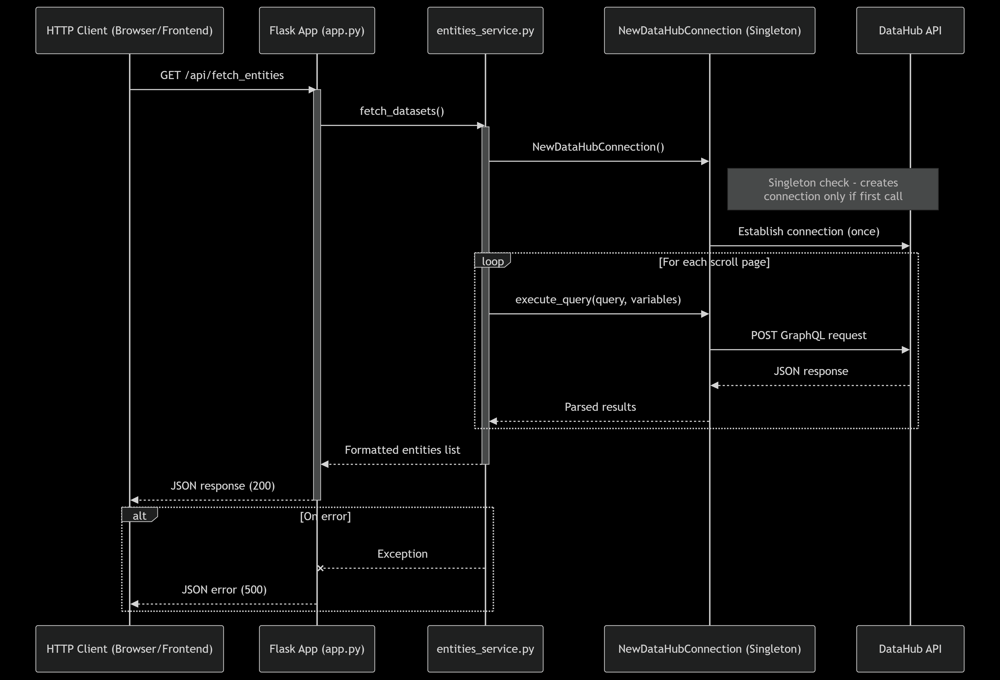

# DataHub Integration Demo

A fullstack application displaying DataHub datasets via Vue.js frontend and Flask backend.

## Architecture


## Key Features
- 🗂️ Dataset display in responsive cards
- 🔄 Singleton connection manager for DataHub API
- 🚦 Error handling with visual feedback
- 🐳 Dockerized deployment

## Project Structure
```
├── flask-backend/
|   ├── Dockerfile
│   ├── api.py                   # Flask app
│   └── utils/                   # DataHub integration
|       ├── datahub_client.py    # DataHub connection manager
|       └── entities_service.py  # Fetching dataset entities
├── vue-frontend/
|   ├── Dockerfile
│   ├── src/App.vue              # Main component
│   ├── .env                     # Frontend environment vars, used for development
│   ├── nginx.conf               # Production routing rules
│   └── vite.config.js           # Dev/prod configuration
└── docker-compose.yml
```

## Tech Stack
- **Frontend**: Vue + SDX components
- **Backend**: Flask + Gunicorn
- **DataHub**: Python SDK for DataHub + GraphQL
- **Infra**: Docker + Nginx

## Quick Starts
```bash
# Start with Docker (recommended):
docker-compose up --build

# Access:
# - Frontend: http://localhost:3000
# - Backend: http://localhost:5000/api/fetch_entities
```

## Development
```bash
# Backend
cd flask-backend && python -m venv venv && source venv/bin/activate
pip install -r requirements.txt
flask run

# Frontend
cd vue-frontend && npm install
npm run dev
```

## Nginx Configuration
```nginx
# vue-frontend/nginx.conf
server {
    listen 80;
    location / {
        root /usr/share/nginx/html;
        try_files $uri $uri/ /index.html;
    }
    location /api {
        proxy_pass http://backend:5000;
    }
}
```

## API
- `GET /api/fetch_entities`  
  Returns: `[{name, type, urn, description, platform}]`